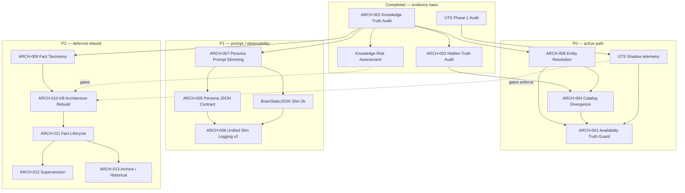

# Nahla Architecture Backlog Registry

> **Single source of truth** for approved architecture investigations, designs, guards, and initiatives.
>
> **Constitution:** Evidence first. Architecture first. Root cause first. Fix later.
> We do not fix conversations. We do not fix merchants. We fix systems.
>
> **Last updated:** 2026-07-21

---

## How to Use

1. Open this file before starting any architecture work.
2. Update **Status**, **Next action**, and **Blocking items** when an initiative moves.
3. Do not open new investigations without registering them here first.
4. Completed audits remain listed — they are dependencies, not deletions.

### Status vocabulary (only these)

`Investigating` · `Designed` · `Shadow` · `Approved` · `Ready` · `In Progress` · `Completed` · `Deferred` · `Rejected`

### Priority vocabulary (only these)

`P0` · `P1` · `P2` · `P3`

---

## Master Backlog Table

| ID | Title | Category | Status | Priority | Owner | Dependencies | Blocking items | Next action | Approval state | Est. effort |
|----|-------|----------|--------|----------|-------|--------------|----------------|-------------|----------------|-------------|
| **ARCH-001** | Product Availability Truth Guard | Operational Guard | **Shadow** | P0 | AI Brain / Postprocess | ARCH-002, ARCH-003, ARCH-008 (partial) | No production shadow evidence; guard default `off` | Complete `ARCH-001-PREPROD-SYNTHETIC-SIGNOFF-v2` lifecycle bundle; then limited allowlisted canary shadow | Approved for shadow; **enforce not approved** | Preprod v2 signoff: **1–2d** · Post-approval shadow: **2–3d** · Enforce: **5–8d** |
| **ARCH-002** | Knowledge Truth Resolution Audit | Investigation | **Completed** | P0 | Architecture / AI Brain | — | — | Archive findings; use as dependency gate for all truth work | Approved & closed (Phase A + B read-only) | **Done** |
| **ARCH-003** | Hidden Truth Conflict Audit | Investigation | **Completed** | P0 | Architecture / AI Brain | ARCH-002 | — | Reference `knowledge_truth_phase_b_output.json` → `hidden_conflict_report` | Approved & closed (Phase B) | **Done** |
| **ARCH-004** | Catalog Divergence Detection | Operational Scanner | **Designed** | P0 | AI Brain / Knowledge | ARCH-002, ARCH-003 | No runtime scanner; detection exists only in audit script | Design read-only shadow scanner reusing Phase B rules (`scripts/knowledge_truth_phase_b_audit.py`) | Design approved; **runtime not approved** | Scanner shadow: **5–7d** · Dashboard surfacing: **+3d** |
| **ARCH-005** | Persona JSON Contract | Prompt Architecture | **Shadow** | P1 | AI Brain / Compose | ARCH-007 | B2 enforcement blocked on B0 shadow baseline | Collect staging `[BRAIN_STATE_SLIM]` persona_contract_shadow metrics | B0 implemented; B2 **not** approved | B0 observe: **1–2d** · B2 enforce: **4–6d** |
| **ARCH-006** | Unified Slim Logging v2 | Observability | **Shadow** | P1 | AI Brain / Compose | ARCH-007, ARCH-005 | Awaiting production/staging baseline | Enable on staging; grep `[BRAIN_STATE_SLIM]` for p50/p95 | **B0 implemented** (telemetry always on) | B0 baseline: **2d** |
| **ARCH-007** | Persona Prompt Slimming | Prompt Architecture | **Designed** | P1 | AI Brain / Compose | ARCH-002 (UTS audit) | Persona enforce would affect personality path — needs B0 evidence | Keep general slim (`NAHLA_SLIM_GENERAL_BRAIN_STATE_ENABLED`) off prod; complete persona-turn slim design review | Design approved; partial code behind flags | General slim: **done (flagged)** · Persona slim enforce: **4–6d** |
| **ARCH-008** | Entity Resolution Improvements | Knowledge / Evidence | **Designed** | P1 | AI Brain / Core | ARCH-002, ARCH-003 | `product_entity_resolution.py` covers availability only; link-time resolution weak | Extend platform-wide entity resolution for KB↔catalog links (year/SKU/family) per Phase B audit | Design approved; **not approved for prod link rewrite** | Core resolver: **8–12d** |
| **ARCH-009** | Knowledge Fact Taxonomy | Knowledge Model | **Designed** | P1 | Knowledge Platform | ARCH-002, Knowledge Architecture Audit | Taxonomy not codified in DB or runtime | Publish canonical `fact_type` / `entity_type` / `authority` enum; map existing `kind` → taxonomy | Design approved in principle | Schema + mapping doc: **5–7d** |
| **ARCH-010** | Knowledge Architecture Rebuild | Knowledge Platform | **Designed** | P2 | Knowledge Platform | ARCH-009, ARCH-002, Incident containment | Explicitly deferred until incident containment path completes | Hold Phase 1–6 migration; maintain parallel-fact-layer design only | **Approved in principle; execution deferred** | Phase 0–2: **4–6 wks** (when unblocked) |
| **ARCH-011** | Fact Lifecycle Model | Knowledge Platform | **Designed** | P2 | Knowledge Platform | ARCH-009, ARCH-010 | No `valid_from` / `valid_until` / `status` on facts today | Design lifecycle states (`active`, `expired`, `superseded`) — no migration yet | Design only; **not approved for implementation** | Model + migration plan: **1–2 wks** |
| **ARCH-012** | Supersession Model | Knowledge Platform | **Designed** | P2 | Knowledge Platform | ARCH-011, ARCH-009 | Requires lifecycle + entity binding first | Specify supersession rules (newer wins, same entity+type) | Design only; **deferred per ADR** | **1 wk** design · **2–3 wks** implement (later) |
| **ARCH-013** | Archive / Historical Fact Handling | Knowledge Platform | **Designed** | P2 | Knowledge Platform | ARCH-011, ARCH-012 | Historical sections injected as active today | Define archive retrieval policy (exclude from prompt by default) | Design only; **deferred** | **1 wk** design · **2 wks** implement (later) |

### Satellite work (approved execution, cross-cutting — not separate projects)

These are **not new initiatives**. They are implementation slices already approved under the Truth Architecture ADR and Persona Slimming track. Listed here so they are not forgotten.

| Work slice | Status | Flags / code | Feeds |
|------------|--------|--------------|-------|
| UTS Phase 1 — Truth Surface Inventory | **Shadow** | `NAHLA_TRUTH_SURFACE_SHADOW_ENABLED` · `truth_surface/` | ARCH-001, ARCH-004, future KTR |
| UTS Phase 2 — UTS v1 manifest | **Shadow** | `NAHLA_UTS_V1_SHADOW_ENABLED` · `uts_v1.py` | ARCH-004, ARCH-010 |
| BrainStateJSON Slim Phase 2b (general turns) | **Shadow** | `NAHLA_SLIM_GENERAL_BRAIN_STATE_ENABLED` · `brain_state_slim.py` | ARCH-006, ARCH-007 |
| Knowledge Risk Assessment | **Completed** | `knowledge_risk_assessment_output.json` | ARCH-001, ARCH-010 gate |

---

## Dependency Graph



**ADR sequencing (approved, not yet registered as separate IDs):**

```
UTS shadow → UTS enforce → Prompt Integrity Gate → KTR → Versioning → Superseding → History Sanitization
```

KTR, Versioning, Superseding, and History Sanitization are **explicitly not started** per executive decision (2026-06). They remain future slices inside ARCH-010, not new projects.

---

## Recommended Execution Order

| Order | ID / slice | Rationale |
|-------|------------|-----------|
| 1 | UTS + ARCH-001 shadow telemetry on staging | Evidence before enforce; zero customer behavior change |
| 2 | ARCH-006 B0 + ARCH-005 contract metrics | Baseline prompt JSON drift on persona turns |
| 3 | ARCH-004 shadow scanner (read-only) | Quantify divergence platform-wide without rewriting replies |
| 4 | ARCH-001 → `enforce` (staging only) | Operational guard after shadow proves conflict detection |
| 5 | ARCH-008 core entity resolution | Fixes root of KB↔catalog blind spots found in ARCH-003 |
| 6 | ARCH-007 persona slim → ARCH-005 B2 | Personality path only after B0 metrics stable |
| 7 | UTS v1 enforce + Prompt Integrity Gate | Single operational ingress before KB rebuild |
| 8 | ARCH-009 taxonomy | Prerequisite for any fact-layer migration |
| 9 | ARCH-010 → ARCH-013 | Parallel fact layer; only after P0/P1 containment proven |

---

## Blocked Initiatives

| ID | Blocked by | Unblock condition |
|----|------------|-------------------|
| **ARCH-001** enforce | No real conflict telemetry / accuracy review | Preprod v2 signoff + post-approval canonical shadow with organic observation |
| **ARCH-004** runtime | ARCH-008 incomplete; no approved scanner design doc | Entity resolution v2 + scanner ADR sign-off |
| **ARCH-005** B2 enforce | ARCH-006 B0 baseline missing | Staging metrics: contract compliance ≥95% on persona turns |
| **ARCH-007** persona enforce | ARCH-005 B0 + constitution check (personality non-deterministic) | B0 review + explicit B2 approval |
| **ARCH-010** | Incident containment incomplete; UTS enforce not proven | Knowledge Risk Assessment actions closed + UTS enforce shadow clean |
| **ARCH-011 – ARCH-013** | ARCH-009, ARCH-010, ADR deferral | Taxonomy published + rebuild Phase 0 approved |
| **UTS enforce** | Shadow baseline not reviewed | Phase 1+2 shadow logs reviewed; integrity gate false-positive rate acceptable |

---

## Ready Now

These have **approved design + implemented code behind flags** and can start staging rollout immediately:

| ID / slice | Ready action | Flag / entrypoint |
|------------|--------------|-------------------|
| **ARCH-001** shadow | Preprod v2 synthetic signoff operator | `scripts/operators/product_availability_preprod_synthetic_signoff_v2.py` |
| **ARCH-006** B0 | Enable slim telemetry | `NAHLA_SLIM_GENERAL_BRAIN_STATE_ENABLED=true` + `[BRAIN_STATE_SLIM]` |
| **ARCH-005** B0 | Contract metrics (no prompt change) | `persona_json_contract.py` via slim log path |
| UTS Phase 1 | Inventory shadow | `NAHLA_TRUTH_SURFACE_SHADOW_ENABLED=true` |
| UTS Phase 2 | UTS v1 manifest shadow | `NAHLA_UTS_V1_SHADOW_ENABLED=true` |
| BrainStateJSON Slim 2b | General-turn noise reduction (opt-in) | `NAHLA_SLIM_GENERAL_BRAIN_STATE_ENABLED=true` |

**Scripts ready (read-only, no rollout):**

- `scripts/knowledge_truth_phase_b_audit.py` — ARCH-003, ARCH-004 detection rules
- `scripts/knowledge_risk_assessment.py` — platform risk quantification

---

## Do Not Start Yet

| ID / topic | Reason |
|------------|--------|
| **ARCH-010** Phases 1–6 | Executive hold until incident containment proven |
| **ARCH-011 – ARCH-013** | Depend on taxonomy + rebuild; ADR explicitly deferred |
| **ARCH-001** enforce on production | Constitution: evidence before customer-visible rewrite |
| **ARCH-005 / ARCH-007** B2 enforce | Personality path; B0 shadow required first |
| **UTS enforce** (`NAHLA_UTS_V1_ENFORCE_ENABLED`) | Prompt mutation blocked until shadow baseline |
| **KTR** (Knowledge Truth Resolver) | Subsumed by UTS path; not approved as first move |
| **Versioning / Superseding / History Sanitization** | ADR-ordered after UTS enforce + integrity gate |
| **Phase A Clarification prod rollout** | Frozen — operational test channel blocker (`docs/runbooks/PHASE_A_FREEZE_STATUS.md`) |

---

## Effort Summary

| Priority | Initiatives | Near-term (staging evidence) | Full delivery |
|----------|-------------|------------------------------|---------------|
| **P0** | ARCH-001, ARCH-004 | **1–2 wks** (shadow only) | **3–5 wks** (through enforce + scanner) |
| **P1** | ARCH-005 – ARCH-009 | **2–3 wks** (B0 + resolver design) | **6–10 wks** (B2 + resolver + taxonomy) |
| **P2** | ARCH-010 – ARCH-013 | **0** (deferred) | **8–12 wks** (when unblocked) |

---

## Key Evidence & Code Anchors

| Initiative | Evidence / implementation |
|------------|----------------------------|
| ARCH-001 | `product_availability_evidence.py`, `product_availability_truth_guard.py`, `test_product_availability_truth_guard.py` |
| ARCH-002 | `scripts/knowledge_truth_phase_b_audit.py`, `.cursor/agents/tahqiq-tadarrub-al-haqaq.md` |
| ARCH-003 | `knowledge_truth_phase_b_output.json` → `hidden_conflict_report`, `scanner_blind_spots` |
| ARCH-004 | `knowledge_truth_phase_b_output.json` → `catalog_divergence` |
| ARCH-005 | `persona_json_contract.py`, `test_persona_expression_phase3b.py` |
| ARCH-006 | `brain_state_slim.py` → `[BRAIN_STATE_SLIM]`, `test_brain_state_slim_b0.py` |
| ARCH-007 | `brain_state_slim.py`, `persona_expression.py` → `slim_brain_state_dict_for_persona` |
| ARCH-008 | `product_entity_resolution.py`, Phase B `entity_resolution_audit` |
| ARCH-009 – 013 | Knowledge Architecture Audit + Rebuild Plan (agent transcript 2026-06) |
| UTS | `backend/modules/ai/brain/truth_surface/` |
| Constitution | `AGENTS.md`, `.cursor/agents/dastoor-handasat-nahla.md` |
| Fixed-tenant policy | `backend/modules/platform/fixed_tenant_policy.py`, `test_fixed_tenant_policy.py`, `test_constitution_compliance.py` |

---

## Platform tenant isolation (acceptance vs runtime)

| Topic | Status | Notes |
|-------|--------|-------|
| **Tenant 33 (acceptance merchant)** | **Acceptance-only** | Real-channel acceptance, manifests, and labeled operator tooling may reference tenant 33 explicitly. Production runtime defaults and ops-script implicit defaults must **not** depend on tenant 33. Enforced by `fixed_tenant_policy` AST gate in `constitution-compliance` CI. |
| **Platform tenant 1 (`PLATFORM_TENANT_ID`)** | **Pending migration** | Separate auth/platform-tenant convention remains unchanged in this track. Narrow literal registry in `fixed_tenant_policy.PLATFORM_TENANT_LITERAL_REGISTRY`; full removal tracked as follow-up — **do not expand** new runtime dependencies on tenant 1. |

---

## Change Log

| Date | Change |
|------|--------|
| 2026-07-18 | Tenant 33 confined to acceptance/tests/manifests; deny-all persona composer default; static CI gate |
| 2026-06-06 | Initial registry — 13 initiatives + satellite UTS/slim slices |
| 2026-06-06 | ARCH-005/006 B0 implemented — unified `[BRAIN_STATE_SLIM]` v2 telemetry |
