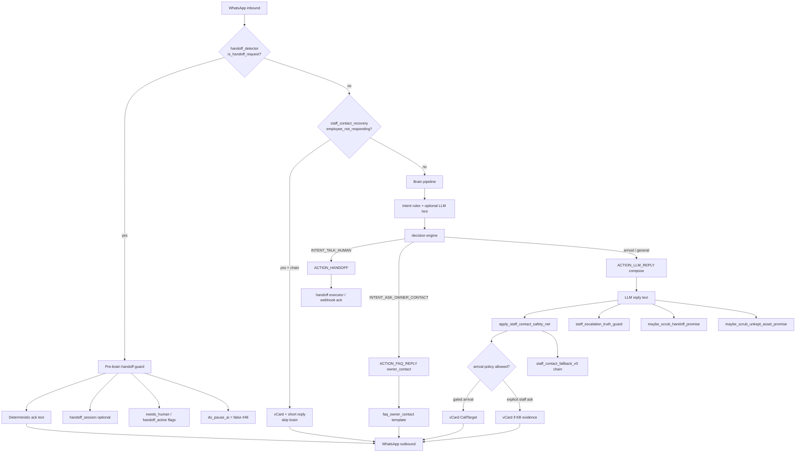

# Staff Escalation & Contact Flow Audit

> **Status:** PR — Audit & Inventory (read-only reference)  
> **Last updated:** 2026-06-13  
> **Doctrine alignment:** [AGENTS.md](../../AGENTS.md) — operational phone/handoff claims require evidence; personality is non-deterministic; platform-wide solutions only.

This document maps how Nahla handles **staff contact requests**, **customer-service numbers**, **human handoff**, and **in-person arrival contact** today. It is diagnostic only — **no production behavior should change based on this doc alone.**

---

## 1. Summary

Staff escalation and contact delivery in Nahla are **not one path** — they are a stack of partially overlapping layers:

| Layer | Role | Deterministic? |
|-------|------|----------------|
| Pre-brain `handoff_detector` | Catches explicit “talk to human / owner / staff” before LLM | Yes |
| Brain intent rules | `INTENT_TALK_HUMAN`, `INTENT_ASK_OWNER_CONTACT`, arrival classifiers | Mostly yes |
| Decision engine | Routes to `ACTION_HANDOFF`, `ACTION_FAQ_REPLY`, or `ACTION_LLM_REPLY` | Yes |
| Compose / LLM | Natural wording; may mention staff names from KB context | No (personality) |
| Post-LLM safety nets | `apply_staff_contact_safety_net` — vCard when KB has evidence | Yes (when fired) |
| Pre-LLM recovery | `maybe_staff_contact_recovery` — chain advance on «ما يرد» | Yes |
| Wire sanitizers | Scrub false handoff promises and unkept asset promises | Yes |
| Truth guard | `apply_staff_escalation_truth_guard` — block “تم تحويلك” without evidence | Yes |

**Key finding:** Phone delivery is **not** centrally policy-driven today. It depends on (a) KB free-text shape (`label:phone`, proximity pairing), (b) optional `metadata_json` for arrival policy and role aliases, (c) a platform-wide hardcoded name/role candidate list in the safety net, and (d) store profile `contact_phone` for generic FAQ — not per-staff structured contacts.

**There is no `merchant_escalation_contacts` table.** Escalation contacts live in unstructured KB body text, legacy `ai_settings.escalation_rules`, and sparse `metadata_json` — not in a first-class schema.

**AI pause:** Per May 2026 #46 (`resolve_handoff_pause_policy`), customer-side handoff **does not** auto-`pause_ai`. Only manual dashboard pause silences the brain. Handoff sessions and `needs_human` flags are advisory for staff visibility.

---

## 2. Current user scenarios

For each inbound phrase, the table below describes **typical** routing today (actual outcome still depends on tenant KB configuration).

| Customer message | `handoff_detector` | Brain intent | Staff fallback / recovery | Arrival policy | LLM involved? | Post-LLM safety net | vCard vs text promise |
|------------------|-------------------|--------------|---------------------------|----------------|---------------|---------------------|------------------------|
| `ابي رقم خدمة العملاء` | Sometimes (exact «خدمه العملاء») | **`INTENT_ASK_OWNER_CONTACT`** (pattern `رقم خدمة العملاء`) | No | No | FAQ path: usually **no** LLM if rules win | May fire if reply offers contact without digits | FAQ uses **`store_contact_phone`** from store profile; safety net may attach KB CS number if structured |
| `ارسل رقم هيثم` | Unlikely alone | Often **`INTENT_ASK_OWNER_CONTACT`** or general → LLM | No (unless prior vCard + «ما يرد») | No | **Often yes** if no rule match | **Yes** — name `هيثم` in `_STAFF_NAME_CANDIDATES` + KB scan | vCard **only if** KB has name+phone pair resolvable |
| `ابي اكلم موظف` | **Yes** (`is_handoff_request`) | **`INTENT_TALK_HUMAN`** → `ACTION_HANDOFF` | No | No | Pre-brain ack **or** brain handoff — often **no** product LLM on that turn | Unlikely on ack turn | **Ack only** — no auto phone (by design) |
| `وصلني بأحد` | Partial substring match | **`INTENT_TALK_HUMAN`** if rules match | No | No | Handoff ack / LLM | If LLM names someone without `[CALL:]` | Promise risk → scrubber |
| `البائع ما يرد` | No | General or frustration | **`maybe_staff_contact_recovery`** + safety-net **`staff_contact_fallback_v0`** | No | Recovery path **skips brain** when chain resolves | Yes on LLM path | **vCard** if next chain entry found in KB |
| `انا عند المعرض` | No | General / location-adjacent | No | **`classify_store_arrival`** + **`resolve_arrival_contact_policy`** | Often LLM for wording | **Gated** — only if merchant opted in | vCard if policy `allowed=true` and contact resolved |
| `ارسل رقم المندوب` | Unlikely | Owner contact or LLM | No | No | Often LLM | Yes — role noun `المندوب` in candidate list | Depends on KB `label:phone` / proximity |
| `مافي رقم؟` | No | Follow-up / general | Fallback if `staff_contacts_sent` + not-responding | No | Often LLM | Pronoun follow-up uses **history** + KB scan | Often **fails** if prior turn did not establish resolvable name |

### Scenario notes

- **Named staff by first name** (`هيثم`, `أمين`, `هشام`): Resolution is **not** alias-aware beyond substring match against `_STAFF_NAME_CANDIDATES` and KB body scan. KB must contain the name near a phone (≤220 char window) or `label:phone` line format preferred by `staff_contact_fallback_v0`.
- **Customer service generic**: Split between FAQ template (`faq_owner_contact` + `commerce_facts.store_contact_phone`) and handoff ack copy — not a unified “first active escalation contact” policy.
- **Owner / management**: Pre-brain owner tier (`classify_owner_escalation_tier`) sends clarifier or handoff ack; **explicit design principle: owner phone is not auto-shared on first ask** (`handoff_detector.py` comments, May 2026 #44).

---

## 3. Current flow diagram

**Ordering (webhook):** Pre-brain handoff → staff contact recovery (pre-brain) → brain → post-compose safety nets → sanitizers → truth guard → dispatch.

---

## 4. Data sources

| Source | Location | Used for staff/contact today? | Structured? |
|--------|----------|------------------------------|-------------|
| **`merchant_knowledge_sections`** | DB table; `kind`, `title`, `body`, `metadata_json` | **Primary** staff phone directory via free-text scan (`branches`, `escalation_rules`, `custom`, `faq`, …) | Partial — body is free text; metadata optional |
| **`metadata_json`** | On KB sections | `arrival_contact`, `role`, `aliases`, `staff_contact_roles`, `intent` + `artifact_target` | Semi-structured when merchants fill it |
| **`brain_state.staff_contacts_sent[]`** | `conversation.extra_metadata.brain_state` | Tracks `{name, phone, turn}` already sent; drives escalation chain advance | Yes (runtime memory) |
| **`commerce_facts.store_contact_phone`** | Loaded from store/tenant profile via `DefaultFactsLoader` | Generic FAQ owner/contact template | Yes (single store phone) |
| **Legacy `ai_settings.escalation_rules`** | `tenant_settings.ai_settings` JSONB | Arrival policy heuristic + behavioral overlay; **not** authoritative phone registry | Free text |
| **Store profile / owner profile** | Tenant/store config (via facts loader) | `store_contact_phone`, `store_contact_email`, `store_url` | Yes (one contact block) |
| **`Conversation` handoff flags** | `needs_human`, `handoff_active`, `is_human_handoff`, `status`, `ai_paused` | Handoff evidence + sanitizer gating | Yes |
| **`handoff_session`** | `handoff.manager` | Evidence for escalation truth guard | Yes |

### Tables that do **not** exist today

- **`merchant_escalation_contacts`** — **not present** in `database/models.py` or migrations. All per-staff numbers are inferred from KB text or LLM context.
- No dedicated **staff roster** table separate from KB sections.

---

## 5. Current files and responsibilities

| File | Responsibility |
|------|----------------|
| **`backend/core/handoff_detector.py`** | Pre-brain Arabic/English handoff phrase library; owner-contact subset; complaint tier; **`resolve_handoff_pause_policy`** (AI stays alive); deterministic ack strings |
| **`backend/modules/ai/brain/intent/rules.py`** | `INTENT_TALK_HUMAN`, `INTENT_ASK_OWNER_CONTACT` regex rules |
| **`backend/modules/ai/brain/intent/classifier.py`** | LLM hint can reinforce `INTENT_TALK_HUMAN` |
| **`backend/modules/ai/brain/decision/engine.py`** | `INTENT_TALK_HUMAN` → `ACTION_HANDOFF`; service-availability gate exception; `INTENT_ASK_OWNER_CONTACT` → `ACTION_FAQ_REPLY` |
| **`backend/modules/ai/brain/execution/faq.py`** | Packages `store_contact_phone` for FAQ topics |
| **`backend/modules/ai/brain/compose/templates.py`** | `faq_owner_contact()` — generic “وسائل التواصل المتاحة” or honest empty state |
| **`backend/modules/ai/brain/commerce/contact_escalation.py`** | `classify_employee_not_responding`, `classify_store_arrival`, `staff_contacts_sent` persistence, `[CONTACT_ESCALATION]` telemetry |
| **`backend/modules/ai/brain/commerce/staff_contact_fallback_v0.py`** | KB-ordered escalation **chain**; role alias graph from metadata/body; owner excluded unless explicit owner alias match |
| **`backend/modules/ai/brain/commerce/staff_contact_recovery.py`** | Pre-LLM short-circuit: «ما يرد» + prior `staff_contacts_sent` → next chain contact + vCard |
| **`backend/modules/ai/brain/commerce/arrival_contact_policy.py`** | Merchant **opt-in** probe for arrival staff contact (metadata + dual text match + legacy escalation_rules) |
| **`backend/modules/ai/brain/commerce/arrival_contact_compile_v0.py`** | Compiles `arrival_contact` artifact: policy + primary showroom seller lookup |
| **`backend/modules/ai/postprocess/safety_nets.py`** | **`apply_staff_contact_safety_net`** — KB/reply/history resolver, `_STAFF_NAME_CANDIDATES`, vCard attachment |
| **`backend/modules/ai/brain/postprocess/staff_escalation_evidence.py`** | Evidence helper: handoff session, deterministic paths, metadata |
| **`backend/modules/ai/brain/postprocess/staff_escalation_truth_guard.py`** | Blocks false “تم تحويلك / تم التصعيد” without evidence |
| **`backend/core/outbound_sanitizer.py`** | **`maybe_scrub_handoff_promise`**, **`maybe_scrub_unkept_asset_promise`** |
| **`backend/modules/ai/brain/relational/safety_net_gate.py`** | Relational suppression — **`staff_contact` is NEVER suppressible** |
| **`backend/handoff/manager.py`** | Creates handoff sessions |
| **`backend/routers/whatsapp_webhook.py`** | Wires pre-brain handoff, recovery, safety nets, sanitizers, truth guard |

### Tests (reference behavior)

- `backend/tests/test_staff_contact_kb_scan.py` — KB proximity / resolver chain
- `backend/tests/test_staff_contact_fallback_v0.py` — chain order, owner gating
- `backend/tests/test_staff_contact_recovery.py` — pre-LLM recovery
- `backend/tests/test_arrival_contact_policy.py`, `test_arrival_contact_compile_v0.py`, `test_arrival_staff_contact_gating.py`
- `backend/tests/test_contact_escalation.py`
- `backend/tests/test_staff_escalation_truth_guard.py`
- `backend/tests/test_handoff_promise_sanitizer.py`
- `tests/test_handoff_detector.py`, `tests/test_handoff_pause_policy.py`

---

## 6. Where generic / canned replies come from

| Copy shape | Source | Example |
|------------|--------|---------|
| Pre-brain handoff ack | **`handoff_detector` constants** | `HANDOFF_ACK_TEXT_AR`, owner tier acks |
| Support escalation replay | **Webhook hardcoded** | «وصلت رسالتك. تم تحويل المحادثة لفريق المتجر…» (`whatsapp_webhook.py`) |
| FAQ owner/contact | **`templates.faq_owner_contact`** | «هذه وسائل التواصل المتاحة» + profile phone |
| Recovery short reply | **`staff_contact_recovery._build_recovery_reply_text`** | «حاضر، جرّب التواصل مع {name}.» |
| False handoff scrub | **`outbound_sanitizer._HANDOFF_NEUTRAL_TEXT`** | «تمام 🌷 وصلت رسالتك، وسأخبر فريق المتجر…» |
| False escalation scrub | **`staff_escalation_truth_guard.SAFE_NO_ESCALATION_EVIDENCE_REPLY_AR`** | «تمام 🌷 وصلت رسالتك.» |
| Unkept asset promise scrub | **`outbound_sanitizer`** promise patterns | Rewrites «تفضل رقم …» when no phone attached |
| Generic LLM warmth | **Compose / persona** | «أقدر أوصلك»، «تواصل مع …» without `[CALL:]` |

**Doctrine tension:** Several canned strings **imply** staff follow-up or transfer without going through `staff_escalation_evidence` — mitigated partially by scrubbers and truth guard, but not unified under one evidence policy.

---

## 7. Where phone evidence is required today

| Path | Evidence required | Mechanism |
|------|-------------------|-----------|
| Safety net vCard | KB name+phone pair, reply digits, or fallback chain entry with normalized phone | Resolver + `CallTarget` |
| Staff contact recovery | Prior `staff_contacts_sent` + next entry in KB chain | `resolve_staff_contact_fallback_v0` |
| Arrival vCard | **`merchant_allows_arrival_staff_contact` == true** + resolved showroom contact | Policy compile v0 |
| FAQ owner contact | **`commerce_facts.store_contact_phone`** non-empty | Deterministic template |
| LLM `[CALL:name\|phone]` marker | Marker in compose output | Marker resolution pipeline |
| Handoff ack | **No phone** — session/flags only | By design |

**`staff_contact_fallback_v0` prefers `label:phone` lines** (`_LABEL_PHONE_LINE_RE`). Proximity pairing in safety net uses 220-char window — brittle for long KB paragraphs.

---

## 8. Where phone promises can happen without evidence

| Gap | How it happens |
|-----|----------------|
| LLM prose promise | Model says «تفضل رقم هيثم» or «تواصل مع أمين» without digits or marker |
| Reply-offer gating | Bot offers staff by name; vCard blocked if **arrival policy** denied even when explicit ask would fire |
| Name not in candidate list | Customer asks for staff name **not** in `_STAFF_NAME_CANDIDATES` and not in KB alias metadata → resolver may not trigger |
| KB unstructured | Phone in KB body without label line or outside proximity window → scan miss |
| FAQ empty profile | `faq_owner_contact` falls through to «لا توجد وسيلة تواصل… **لكن يمكنني مساعدتك أو تحويل طلبك للفريق**» — soft transfer promise without handoff evidence |
| Support escalation string | Webhook sends «تم تحويل المحادثة» when flags set — may not always correlate with `staff_escalation_evidence` paths on every branch |
| Handoff neutral scrub | Replaces promise with «سأخبر فريق المتجر» — still a soft operational claim |
| Owner first contact | Clarifier ack promises forward to management without session evidence on VAGUE tier |

---

## 9. Existing safeguards

| Safeguard | What it blocks / adds |
|-----------|----------------------|
| **`apply_staff_escalation_truth_guard`** | False «تم تحويلك / تم التصعيد» when no structured escalation evidence |
| **`maybe_scrub_handoff_promise`** | Handoff wording when `handoff_state_active` is false |
| **`maybe_scrub_unkept_asset_promise`** | «سأرسل الرابط/الباركود/الرقم» when asset not queued |
| **`staff_contact_fallback_v0` owner gating** | Owner numbers excluded from showroom chain unless explicit owner alias |
| **`arrival_contact_policy`** | No arrival vCard without merchant opt-in |
| **`resolve_handoff_pause_policy`** | No auto `pause_ai` on customer escalation (#46) |
| **`relational/safety_net_gate`** | Cannot suppress `staff_contact` net during relational moments |
| **`contact_already_sent` / chain index** | Avoids repeating same staff contact in chain advance |
| **Telemetry** | `[STAFF_CONTACT_RESOLVER]`, `[CONTACT_ESCALATION]`, `[STAFF_ESCALATION_TRUTH_GUARD]`, `[ARRIVAL_CONTACT_POLICY]` |

---

## 10. Gaps vs Nahla Doctrine

| Doctrine rule | Current gap |
|---------------|-------------|
| **No invented numbers** | LLM can still **say** a number in plain text if KB leaked into prompt; safety net only adds vCard post-hoc |
| **No transfer promise without evidence** | Multiple ack/scrub strings still imply team follow-up; FAQ empty-state mentions «تحويل طلبك للفريق» |
| **No owner fallback unless configured** | Partially enforced — owner excluded from chain, but generic FAQ may still show store phone |
| **No hardcode for tenant 33 / staff names** | **`_STAFF_NAME_CANDIDATES`** in `safety_nets.py` hardcodes common Saudi names (أمين، هيثم، هشام، …) — **platform-wide**, not tenant-scoped |
| **No prompt-only operational truth** | Staff contact still relies heavily on LLM wording + post-hoc nets |
| **AI continuity** | **Improved** (#46) — handoff no longer pauses AI by default |
| **Platform-wide policy** | Arrival compile + fallback v0 are platform-wide; KB shape varies per merchant → inconsistent outcomes |
| **Structured evidence for «أرسل رقم X»** | No first-class alias→phone registry; metadata support exists but underused in dashboard |

---

## 11. Risk areas

1. **KB shape dependency** — Merchants paste contacts in prose; resolver misses without `label:phone` or proximity.
2. **Hardcoded name list** — Names outside `_STAFF_NAME_CANDIDATES` fail silently unless role nouns match.
3. **Alias gap** — «هيثم» vs «ابو هيثم» vs KB-only nickname not in metadata `aliases`.
4. **Split generic CS paths** — FAQ store phone ≠ KB escalation chain ≠ handoff inbox.
5. **Promise / evidence drift** — Scrubbers and truth guard cover subsets; not all branches emit consistent evidence metadata.
6. **Arrival vs explicit ask** — Same safety net, different gates — merchants may not understand opt-in metadata.
7. **Recovery vs brain race** — Recovery skips brain (good for determinism) but only on narrow «not responding» regex.
8. **Dashboard** — `metadata_json` for roles/aliases/arrival not fully exposed in KB UI (see [KNOWLEDGE_BASE_FLOW_AUDIT.md](./KNOWLEDGE_BASE_FLOW_AUDIT.md)).

---

## 12. Recommended staged plan

> **Not in scope for this PR** — documentation of intended fix sequence only.

### Phase A — Guard + Evidence

**Branch (future):** `fix/staff-escalation-contact-policy`

- Single policy: if phone configured **and** allowed for use-case → send vCard; else honest «غير مهيأ» — no invention.
- Named request with unknown alias → «الاسم غير مهيأ للتواصل».
- Customer service request → first **active** contact by policy order.
- Align FAQ, safety net, recovery, and handoff acks with **`staff_escalation_evidence`**.
- Remove or replace soft «تحويل للفريق» copy when no evidence.

### Phase B — Compile policy from KB metadata

- Expand **`metadata_json`** consumption: `role`, `aliases`, `allowed_use_cases`, `escalation_order`, `is_active`.
- Deprecate reliance on free-text proximity for primary resolution.
- Wire compile step similar to `arrival_contact_compile_v0` for general staff contacts.

### Phase C — Structured escalation contacts

If metadata remains insufficient:

**Proposed table:** `merchant_escalation_contacts`

| Field | Purpose |
|-------|---------|
| `tenant_id` | Scope |
| `display_name` | Primary label |
| `aliases` | JSON array — customer phrases |
| `role` | owner / showroom_seller / cs / driver / … |
| `phone` | E.164 or local normalized |
| `channel` | whatsapp / voice |
| `is_active` | Soft delete |
| `escalation_order` | Chain ordering |
| `allowed_use_cases` | arrival / named_request / cs / complaint / … |
| `availability` | Hours / notes |
| `internal_notes` | Merchant-only |
| `created_at`, `updated_at` | Audit |

Migrate from KB scan → compiled policy artifact at runtime.

### Phase D — UI inside Knowledge Base

**Section:** «التصعيد والتواصل» (after schema/policy exists)

- Customer service number
- Authorized staff numbers
- Aliases
- Allowed use cases
- Escalation order
- Availability windows

---

## Appendix A — Diagnostic checklist (per inbound)

Use this when triaging production threads:

1. Did message hit **`is_handoff_request`** before brain?
2. Which **intent** won (`talk_human`, `ask_owner_contact`, general)?
3. Was **`maybe_staff_contact_recovery`** evaluated?
4. Did **`resolve_arrival_contact_policy`** allow contact?
5. Was reply **LLM-composed** or template/handoff ack?
6. Did **`apply_staff_contact_safety_net`** fire? Check `[STAFF_CONTACT_TRACE]`.
7. Was **`staff_contacts_sent`** updated?
8. Any **`maybe_scrub_*`** or **`staff_escalation_truth_guard`** action?
9. Outbound: **vCard** (`CallTarget`) vs plain text vs promise-only?
10. **`ai_paused`** — should be false unless manual pause (#46).

---

## Appendix B — Answers to required questions

| # | Question | Answer (current state) |
|---|----------|------------------------|
| 1 | Named staff request? | **`apply_staff_contact_safety_net`** + KB scan; **`staff_contact_fallback_v0`** on chain advance |
| 2 | Customer service number? | **`INTENT_ASK_OWNER_CONTACT`** → **`faq_owner_contact`** + `store_contact_phone`; may overlap handoff phrases |
| 3 | «أبي أكلم إنسان»? | **`handoff_detector`** pre-brain and/or **`INTENT_TALK_HUMAN`** → **`ACTION_HANDOFF`** — ack, no auto phone |
| 4 | Owner fallback? | **No auto owner phone** on first owner ask; owner in chain only with explicit owner alias |
| 5 | Hardcoded staff names? | **Yes** — `_STAFF_NAME_CANDIDATES` (أمين، هشام، هيثم، …) + role nouns (البائع، المندوب، …) |
| 6 | Platform vs tenant hardcode? | **Platform-wide** list; tenant data still from KB/profile |
| 7 | Why «ارسل رقم هيثم» may fail? | KB missing pair; wrong format; outside proximity; LLM reply-only promise scrubbed; chain exhausted |
| 8 | Alias problem? | **Yes** — limited alias support via metadata in fallback v0; safety net uses substring on hardcoded names |
| 9 | Phone in KB body unstructured? | **Common** — works only if scan/heuristics match |
| 10 | Safety net needs label:phone? | **Preferred** in fallback v0; safety net allows proximity pairing |
| 11 | «أقدر أوصلك» source? | Usually **LLM compose**; sometimes template/fallback; scrubbed if false handoff/asset |
| 12 | Promise without evidence? | **Yes** — see §8 |
| 13 | `pause_ai` paths? | **Manual dashboard only** for customer escalation (#46); other pauses (rate limit, loop guard) separate |
| 14 | Arrival separate from staff? | **Yes** — `arrival_contact_policy` gates arrival triggers; explicit staff asks use broader triggers |
| 15 | Metadata enough vs new table? | **Metadata insufficient at scale** for alias registry + ordering + use-cases; structured table recommended if merchants need reliability |

---

## Related docs

- [KNOWLEDGE_BASE_FLOW_AUDIT.md](./KNOWLEDGE_BASE_FLOW_AUDIT.md) — KB storage, UI gaps, brain consumption
- [AGENTS.md](../../AGENTS.md) — operational vs personality doctrine
