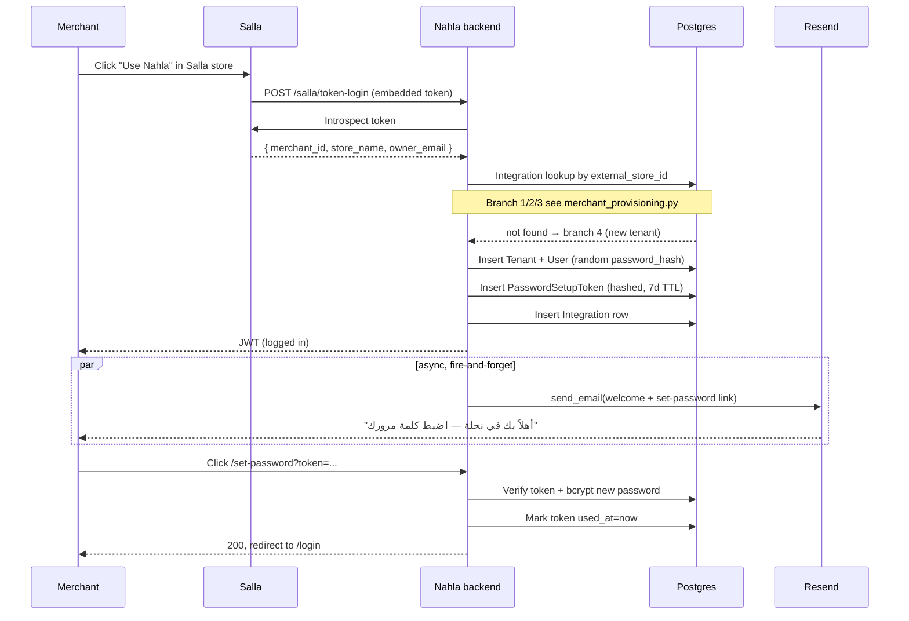

# Merchant Authentication — OAuth + Local Password Coexistence

**Status:** Live (Phase 1B follow-up)
**Owners:** Auth team
**Last touched:** 2026-05-19

This document describes how a Salla / Zid merchant becomes a Nahla user
and how the two login paths (OAuth ↔ local email-password) stay
decoupled. If you're debugging a "merchant can't log in" support
ticket, start here.

---

## The two login paths

A Nahla merchant has exactly two ways to authenticate. They never
interfere with each other.

| Path | Trigger | Identity proof | Affected by local password? |
|------|---------|----------------|-----------------------------|
| **A — OAuth (Salla / Zid)** | Click app inside Salla store / Zid panel | OAuth introspect → `external_store_id` matches an `Integration` row | **No** — OAuth never reads `User.password_hash` |
| **B — Local login** | `app.nahlah.ai/login` form | `email` + bcrypt-verified `password_hash` | Yes — bcrypt match required |

> **Key invariant:** Path A NEVER touches `User.password_hash`. A
> merchant can change, forget, or randomise their local password
> without breaking the in-Salla iframe experience. That's enforced in
> `core/merchant_provisioning.py` — the OAuth resolver only matches
> on `Integration.external_store_id` and returns the user as-is.

---

## Identity model

We deliberately do NOT add a `salla_merchant_id` column to `User`.
Identity flows through the `Integration` table:

```
Integration(provider="salla", external_store_id=<salla_merchant_id>)
    → tenant_id
    → User(tenant_id=..., role="merchant")
```

Lookup priority in `core.merchant_provisioning.get_or_create_merchant_user`:

1. `Integration(provider, external_store_id)` — authoritative
2. `Integration.config['store_id']` — legacy rows; we self-heal on hit
3. `User.email` — last resort, ONLY when introspect failed to give us
   a store_id AND the email is real (not a derived placeholder)

### Why not a column?

* Adding `User.salla_merchant_id` would require a migration + backfill
  AND wouldn't survive Integration deletion (uninstall/reinstall scenarios).
* The Integration table is already authoritative for store identity,
  has the correct unique constraint, and is the source of truth used by
  every Salla worker. Dual-writing both columns would invite drift.
* If we ever need a User-side index for cross-store admin queries, we
  can add a generated/views layer without changing this model.

---

## Auto-creation flow (new merchant)



### Decisions baked into the diagram

* **Email is fire-and-forget** (`asyncio.ensure_future`) so a slow
  Resend API call never blocks the OAuth handshake. Failures are logged
  via `audit("password_setup_email_failed", reason=...)`.
* **Random `password_hash` on insert** — see
  `merchant_provisioning._insert_user`. The merchant CANNOT log in via
  Path B until they consume the token. This is the desired default
  (OAuth-only access until they explicitly opt in).
* **Single-use, hashed token** stored in `password_setup_tokens` —
  raw value only ever exists in the email body.

---

## Set-password token (`PasswordSetupToken`)

| Concern | Choice | Rationale |
|---------|--------|-----------|
| Storage | DB table, SHA-256 hex digest | Survives DB leak; raw value only in email |
| Length | 32 bytes → 43-char base64url | 256 bits of entropy |
| TTL | 7 days for `purpose="welcome"`, 1 hour for `purpose="reset"` | Welcome links sit in inboxes; reset links shouldn't |
| Single-use | `used_at` timestamp | Replay-resistant after consume |
| Rate limit | 10 verify + 10 apply per IP/hr | Forces token guessing to spread across IPs |
| Lifecycle | Issuing a new welcome token invalidates prior unconsumed welcome tokens for the same user | Prevents inbox-spray confusion |

### When tokens are issued

1. **OAuth auto-create** — both `salla_token_login` and the legacy
   `salla_oauth_callback` (when in `salla_new_*` state) call
   `get_or_create_merchant_user`, which issues the token whenever a
   User row is inserted.
2. **Backfill script** — `backend/scripts/backfill_merchant_set_password_emails.py`
   re-issues tokens for existing merchants who never received the
   welcome email. Always starts in dry-run; `--apply` to commit.
3. **Future** — `forgot-password` will eventually move to this same
   primitive (currently uses a non-single-use JWT — a known gap).

### When tokens are NOT issued (skipped)

* `linked_existing` branch — user already has a real password story
* Auto-derived placeholder emails (`@salla-merchant.nahlah.ai`,
  `@zid-merchant.nahlah.ai`) — no real inbox to deliver to

---

## Endpoints

| Method | Path | Auth | Purpose |
|--------|------|------|---------|
| `GET` | `/auth/set-password/verify?token=...` | Public | Validate token without consuming. Returns `{valid, email, expires_at}` or `{valid: false, reason}` |
| `POST` | `/auth/set-password` body=`{token, password}` | Public, rate-limited | Consume token + bcrypt the password. Returns `{detail, email}` |

Failure mode mapping for the consume endpoint:

| Error | HTTP | UI handles |
|-------|------|------------|
| `WeakPassword` | 400 | "كلمة المرور ضعيفة" — re-prompt |
| `InvalidToken` | 400 | "الرابط غير صالح" — surface "missing" UI |
| `ExpiredToken` | 410 | "انتهت صلاحية الرابط" — CTA to /login + forgot-password |
| `UsedToken`    | 410 | "الرابط مستخدم من قبل" — same CTA |

---

## Audit events

| Event | When | Notes |
|-------|------|-------|
| `salla_oauth_merchant_auto_created` | new tenant + user created via Salla | both `salla_token_login` and legacy callback |
| `salla_oauth_linked_existing` | OAuth matched an existing tenant + user | most common after launch |
| `salla_oauth_user_filled_gap` | integration found, user row was missing, we inserted | repair counter — should trend to zero |
| `salla_oauth_login_success` | JWT issued by `salla_token_login` | per-merchant login telemetry |
| `password_setup_email_sent` | welcome email accepted by Resend | success counter |
| `password_setup_email_failed` | Resend returned failure or threw | filter by `reason` field |
| `password_setup_token_consumed` | merchant clicked link + set password | conversion counter |
| `login_success` (existing) | `/auth/login` succeeded | local-login path |
| `login_failed` (existing) | invalid credentials on `/auth/login` | brute-force telemetry |

Inspect with: `rg "audit\(\"salla_oauth_" backend/` or your central
log aggregator's `event` filter.

---

## Common support scenarios

### "Merchant says 'I'm logged out of nahla.ai but Salla still works'"
Expected. They never set a local password (or forgot it). Direct them
to:
* Either keep using the in-Salla iframe (always works), OR
* Click forgot-password on `/login` to receive a reset link.

The forgot-password JWT and the set-password DB token are two
independent secrets. Setting a fresh password via either flow does
not touch the OAuth path.

### "Merchant says 'set-password link expired'"
Run the backfill script for their tenant only:

```bash
python backend/scripts/backfill_merchant_set_password_emails.py \
    --tenant <tenant_id> \
    --apply
```

This issues a fresh 7-day token and re-emails them. Old tokens are
invalidated automatically (single live token per user+purpose).

### "Merchant says 'changed my password and now Salla doesn't work'"
This should be impossible — surface the support log. If verified,
investigate `core.merchant_provisioning.get_or_create_merchant_user`:
the OAuth path must NEVER read `password_hash`. Open a sev-1 ticket if
this code path was bypassed.

### "Welcome email never arrived"
1. Check `audit("password_setup_email_failed", ...)` for the merchant's
   email hash.
2. Check `RESEND_API_KEY` is set and the from-domain is verified.
3. Re-trigger via `backfill_merchant_set_password_emails.py
   --tenant <id> --apply`.

---

## Migration / backfill plan

Existing merchants (provisioned before this change) have:

* a User row with random `password_hash`
* an Integration row
* never received a welcome email

To onboard them onto Path B (local login) we run the backfill in
batches:

1. **Dry-run by tenant** — verify the script targets the right user
   row per integration.
   ```bash
   python backend/scripts/backfill_merchant_set_password_emails.py --tenant 12
   ```

2. **Single-tenant apply** — pilot with one cooperative merchant.
   ```bash
   python backend/scripts/backfill_merchant_set_password_emails.py --tenant 12 --apply
   ```

3. **Staged bulk** — 50/day until done. The cooldown flag
   (`--cooldown-days 14`, default) prevents accidental re-spam.
   ```bash
   python backend/scripts/backfill_merchant_set_password_emails.py --apply --limit 50
   ```

4. **Verify** — `rg "password_setup_email_sent" logs/` should match
   the number of merchants emailed each day. Bounces show up as
   `password_setup_email_failed`.

---

## Out of scope / known gaps

* **2FA on local login** — Phase 2; tracked in the security plan.
* **`forgot-password` migration to single-use DB tokens** — currently
  uses a 1-hour JWT (not single-use). The
  `core.password_setup` primitive is ready to be reused; flipping the
  endpoint is a 1-day task in the next sprint.
* **Zid uses `Integration.external_id` instead of `external_store_id`** —
  pre-existing schema mismatch documented in the audit. The provisioning
  helper will need a small Zid-specific shim until that's normalised.
* **Sync-OAuth callback (`/api/salla/oauth/callback`)** — only updates
  Integration tokens, never creates Users. Untouched by this change.
